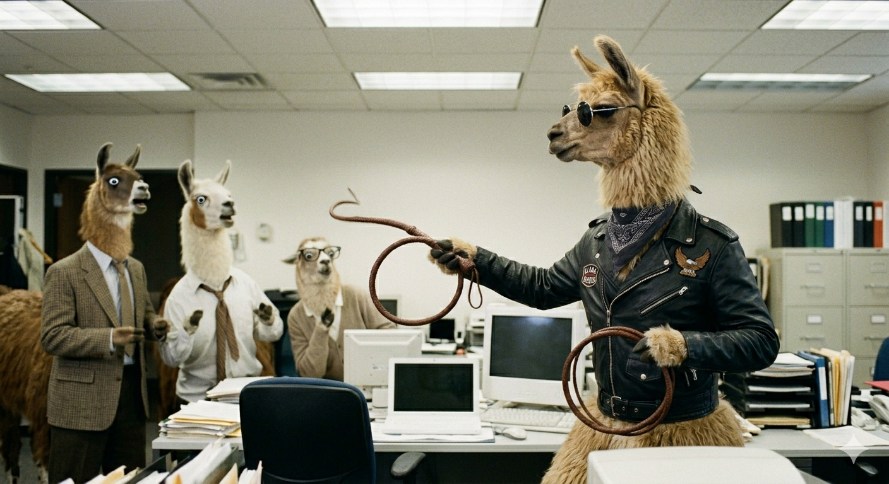
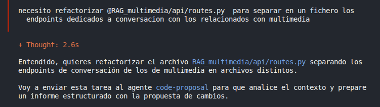
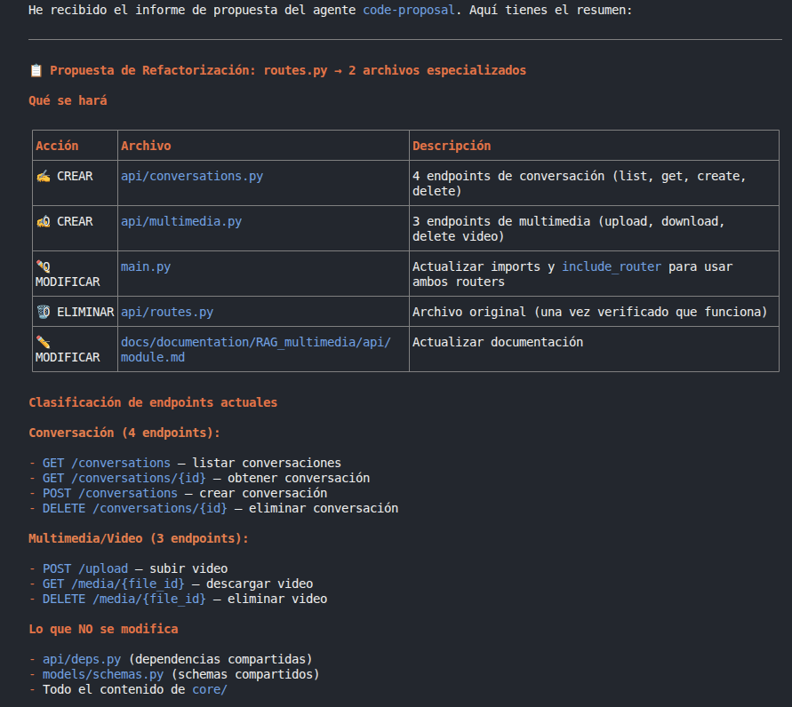
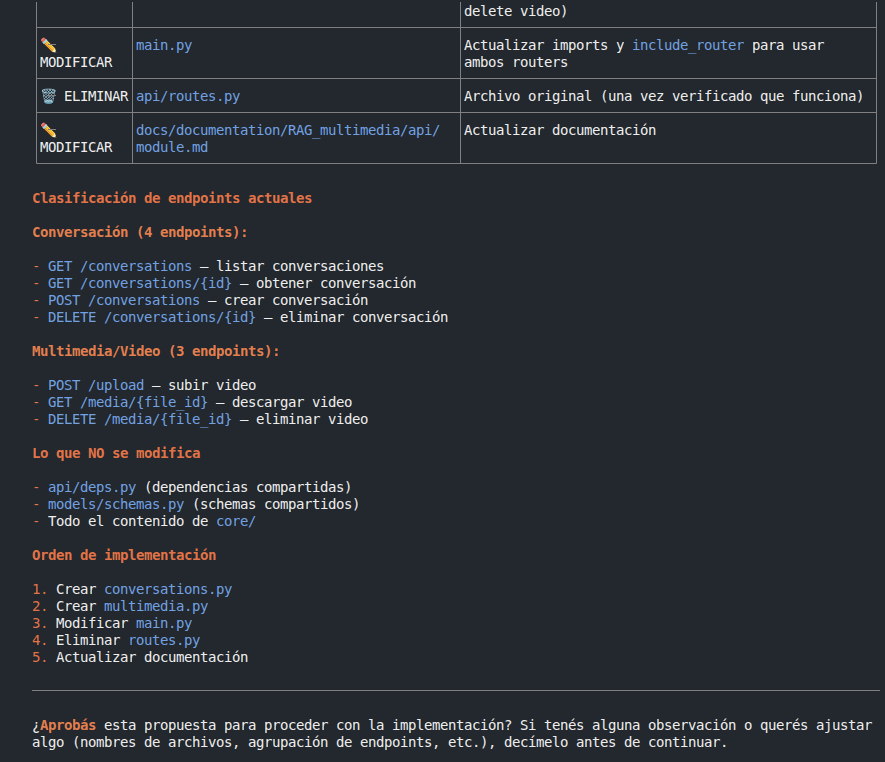
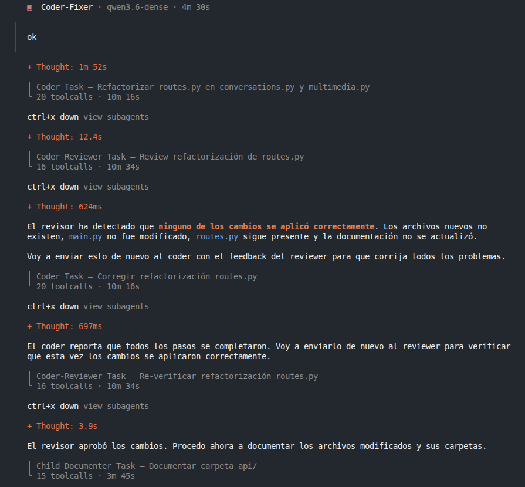
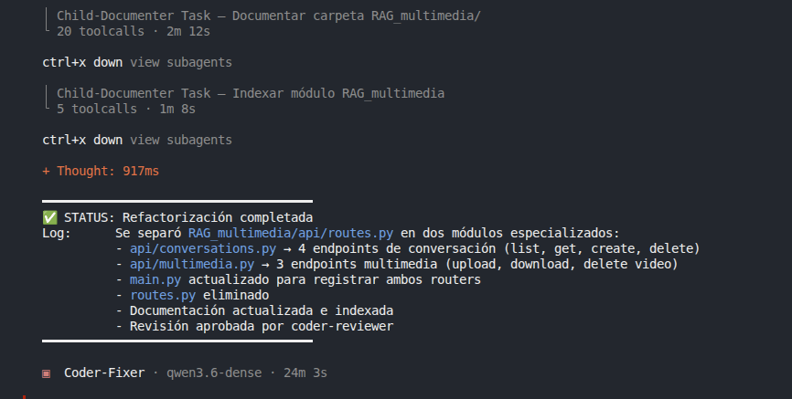

### Coder‑fixer (coder-fixer.md)

**Description:** Agent that receives tasks to fix or modify something about a repository. It never touches code directly - its only responsibility is to communicate with the user, collect the desired changes, and transmit them to its available sub-agents.

**Configuration:**
- **Model:** `ollama/qwen3.6-dense`
- **Tools allowed:** `bash`, `read`, `task`
- **Task delegation:** Only to `coder-proposal`, `coder`, `coder-reviewer`

**Key responsibilities:**
- Collect the task from the user — understand clearly what change, fix, or addition they want.
- Send the task to `coder-proposal` and wait for its technical proposal report.
- Present the proposal summary to the user and wait for confirmation before proceeding.
- Send the task + the approved proposal to `coder` so it implements exactly what was proposed.
- Receive coder's delivery report and send it to `coder-reviewer` along with the original task and approved proposal.
- Handle rejection loops: if rejected, call `coder` again with reviewer's feedback until approved.
- Once approved, invoke `child-documenter` to document modified files and index the documentation.
- Return a summary report to the user.

### Workflow Steps

#### 1. Task Collection

*The agent collects the task from the user and understands what change, fix, or addition is needed.*

#### 2. Technical Proposal

The task is sent to `coder-proposal` which generates a technical proposal report.*

##### Present Proposal to User

*The proposal summary is presented to the user and confirmation is awaited before proceeding.*

#### 3. Implementation

*The task + approved proposal is sent to `coder` for implementation loop.*

#### 4. Review Loop

*The coder's delivery report is sent to `coder-reviewer` for verification.*

##### Rejection Handling

*If `RESULT: REJECTED ❌`, the reviewer's feedback is sent back to `coder` for fixes, then re-evaluated. This repeats until approved.*

*Once approved (`RESULT: APPROVED ✅`), `child-documenter` is invoked in `documentar-carpeta` mode for each modified file's parent folder, then in `indexar-modulo` mode for each generated `.md` file.*

#### 5. Final Report

*A summary report is returned to the user.*

