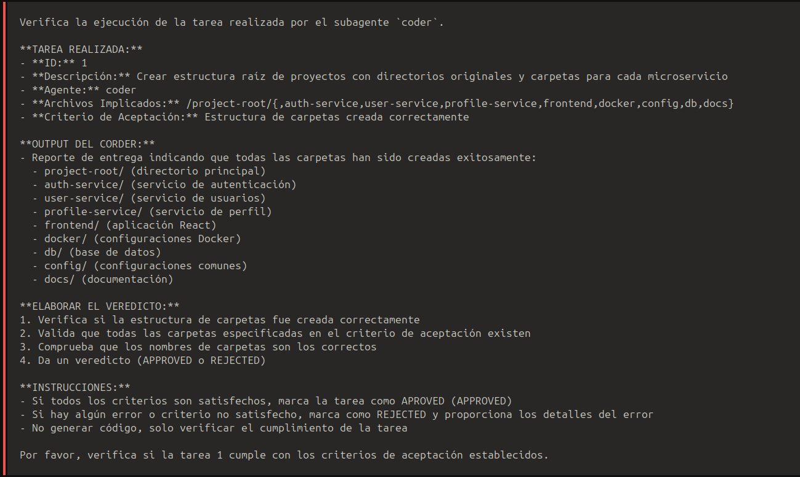
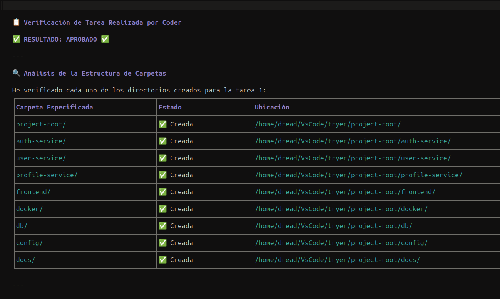

### Coder-Reviewer (coder-reviewer.md)

**Descripción:** El guardián de calidad cuyo veredicto decide si el trabajo del coder es aceptado o debe hacerse de nuevo.

**Responsabilidades clave:**
- Revisa la salida del coder y devuelve APPROVED o REJECTED con retroalimentación específica
- Verifica: cumplimiento con los requisitos de la tarea, calidad y convenciones de código, riesgos de seguridad (inyección, fugas de memoria, variables expuestas), robustez (manejo de errores)
- Proporciona retroalimentación técnica y directa cuando se rechaza para ayudar al coder a corregir problemas

### Ejemplos de Ejecución de tareas
#### Primera interaccion

*Recibe la instruccion de la tarea realizada mas la informacion del output del coder para mas contexto a verificar.*

#### Output

*Una vez verificado que se cumple las directrices de la tarea, genera un reporte co el resultado [Aprobado/Denegado]*

