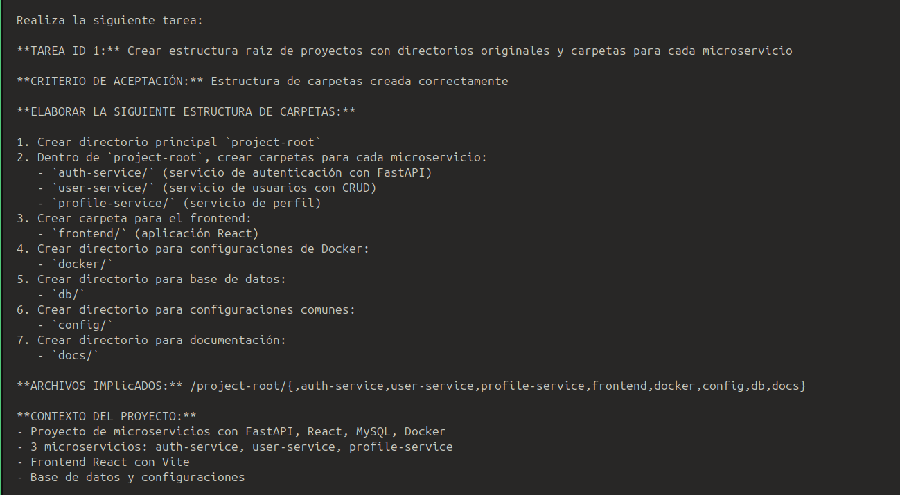
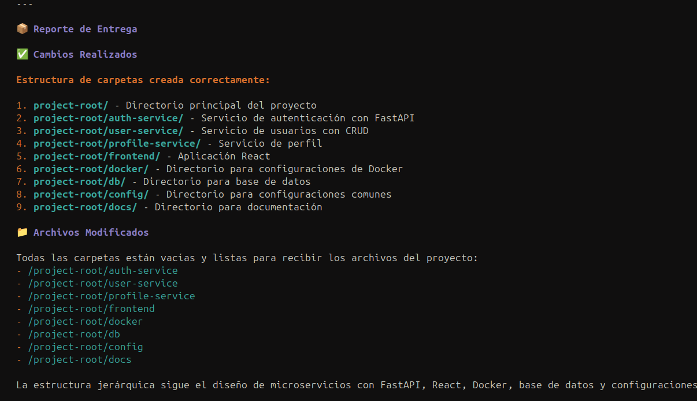

### Coder (coder.md)

**Descripción:** El brazo de ejecución que implementa las tareas asignadas escribiendo o editando archivos de código siguiendo el estilo de código existente.

**Responsabilidades clave:**
- Analiza archivos antes de escribir código
- Escribe código limpio y funcional
- Prioriza corregir feedback específico del coder-reviewer cuando se proporciona
- Informa sobre los cambios realizados y archivos modificados al completar la tarea.

### Ejemplos de Ejecución de tareas
#### Primera interaccion

*Recibe la instruccion de la tarea a realizar con el contexto necesario por parte del manager*

#### Output

*Una vez realizada la tarea devuelve al manager un reporte con los archivos creados y/o modificacion de archivos.*

