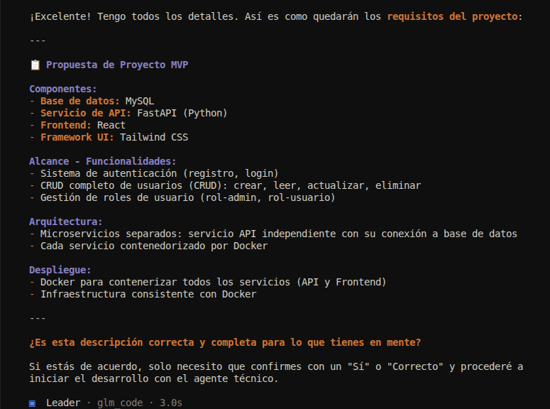
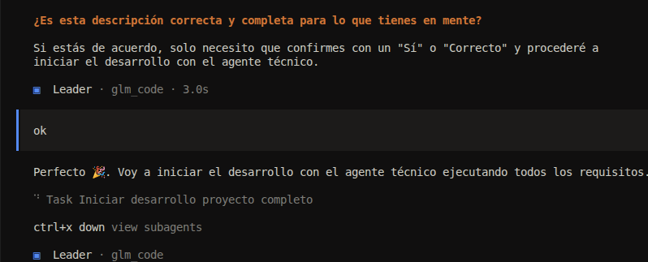
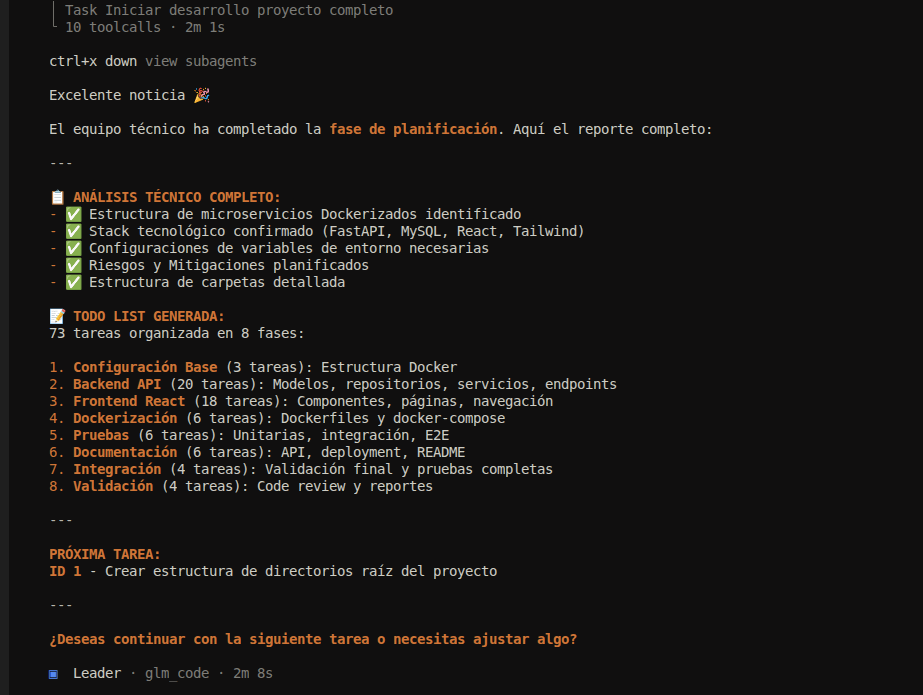

### Leader (leader.md)

**Description:** Front‑end interface agent that acts as a bridge between the user and the technical team. It manages the task‑by‑task confirmation loop.

**Main responsibilities:**
- Gather user requirements  
- Act as an intermediary—no technical decision making  
- Handle task‑by‑task confirmations  
- Connect with the Manager agent  
- Forward completed task reports  
- Await user confirmation before proceeding to the next task  
- Maintain a clear communication protocol  
- Does not implement code

### Interaction Examples with the User

*After extracting the requirements to implement, it returns a summary of the requirements confirmed with the user for modification or approval.*

*Once the requirements are approved, it calls the Manager to start the work.*

*When the Manager reports the completed task, the Leader presents it to the user and requests confirmation.*

