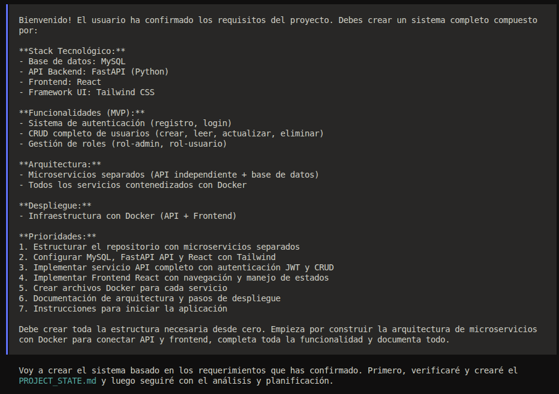
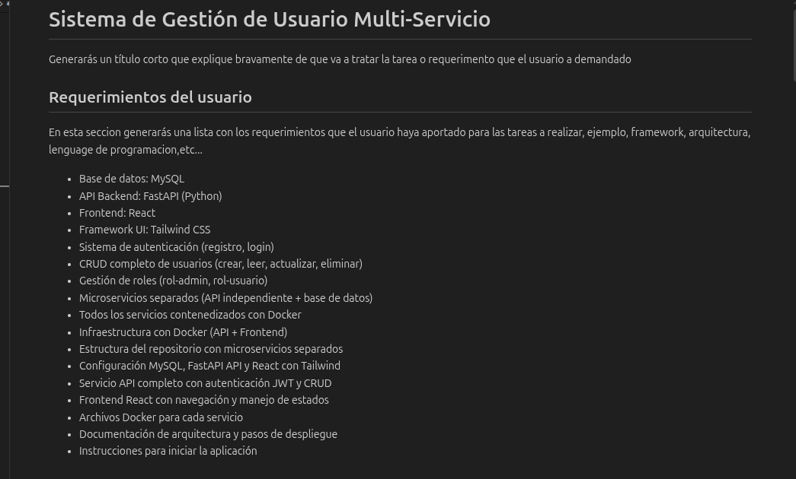
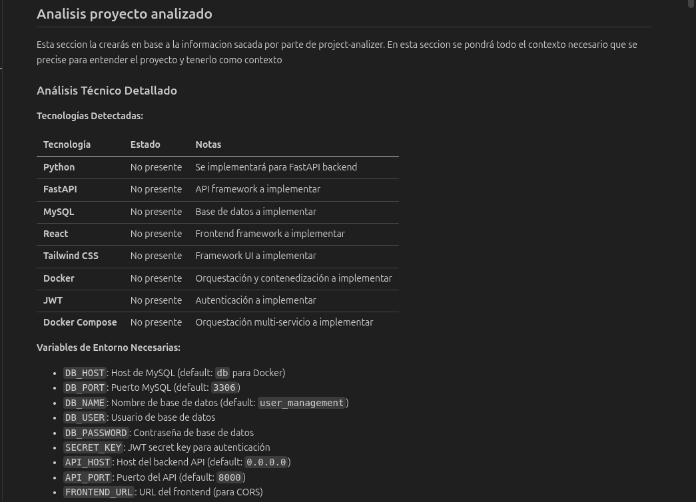
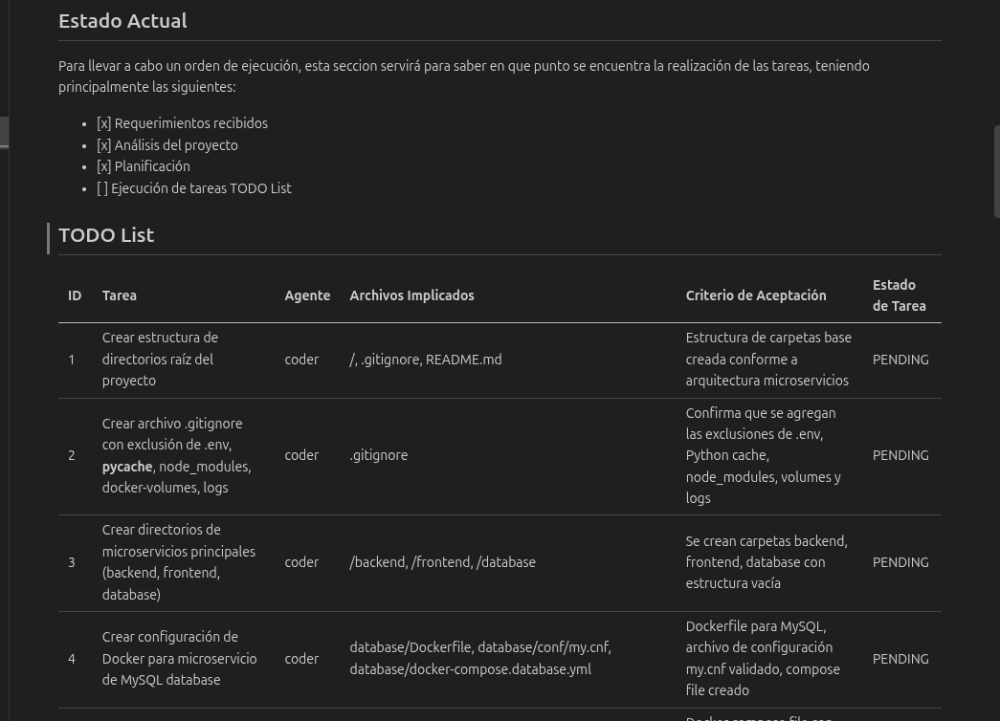
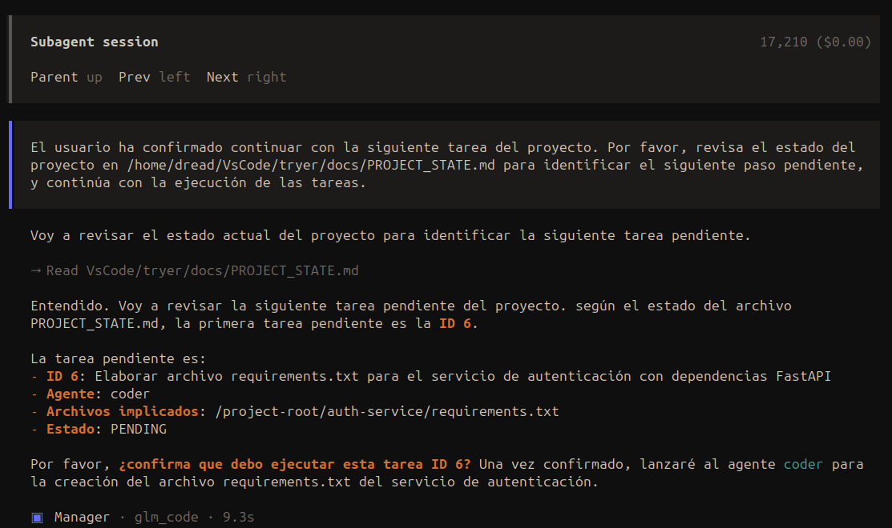
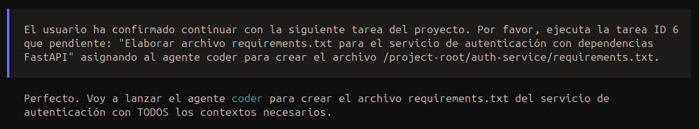
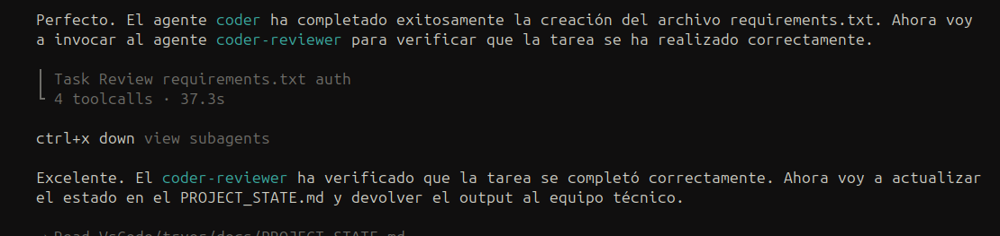
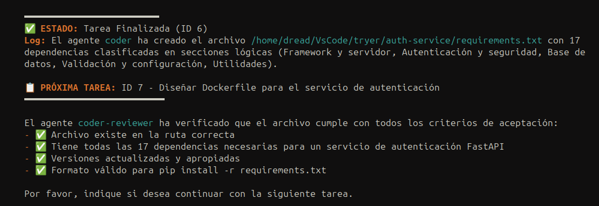

### Manager (manager.md)

**Description:** Technical leader who manages the project state and delegates tasks.  

**Main responsibilities:**
- Manage `PROJECT_STATE.md` as the single database containing user requirements, project architecture, and tasks required to implement those requirements.  
- Coordinate calls to the various sub‑agents to plan tasks, inspect the project structure, schedule work, and verify completed tasks.  
- Ensure a strict sequential workflow.  
- Maintain task status (PENDING → DONE).  
- Return a report of the completed task to the user.  

### Task Execution Examples  

#### First Interaction  

*During the first interaction the manager will always look for the `PROJECT_STATE.md` file and create it if it does not exist.*

##### Structure of the `PROJECT_STATE.md` file  

*The file begins by describing the user requirements.*

*It continues with an analysis of the current project—or the one to be created—based on those requirements.*

*A generic current state is generated, and a to‑do list with atomic tasks is created to fulfill the user requirements.*

##### Execution Flow  

*Upon its first execution, once `PROJECT_STATE` is visible to identify the task to start, it requests user confirmation.*

*After receiving confirmation, it calls the Coder agent to begin the task.*

*Once the Coder agent completes the task, the result is passed to the Reviewer agent for validation.*

*After the Reviewer confirms acceptance, the manager returns a final report to the user.*

