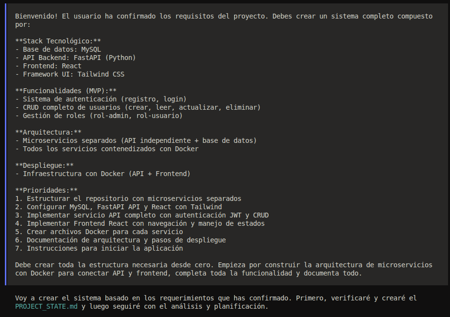
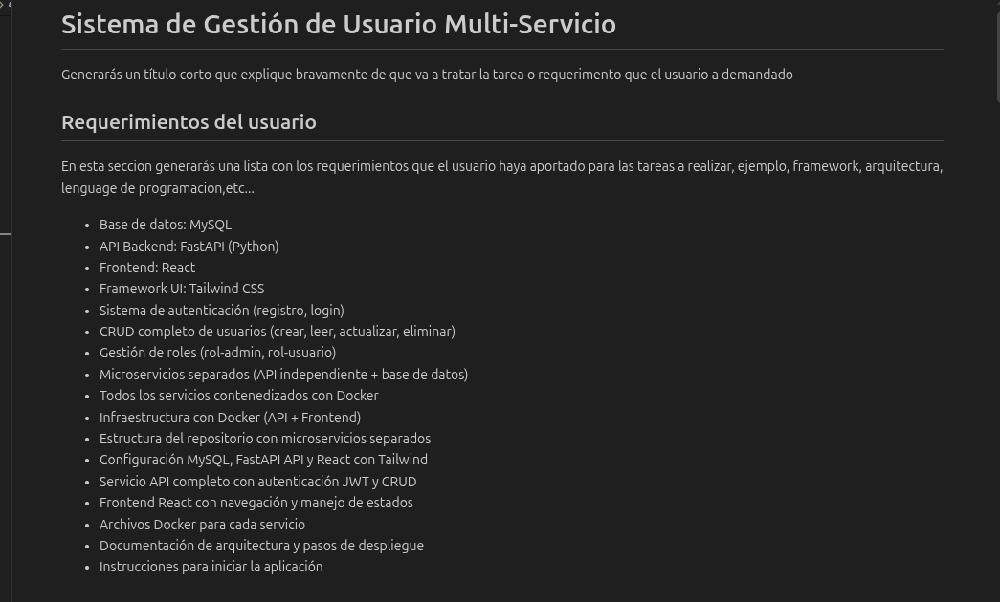
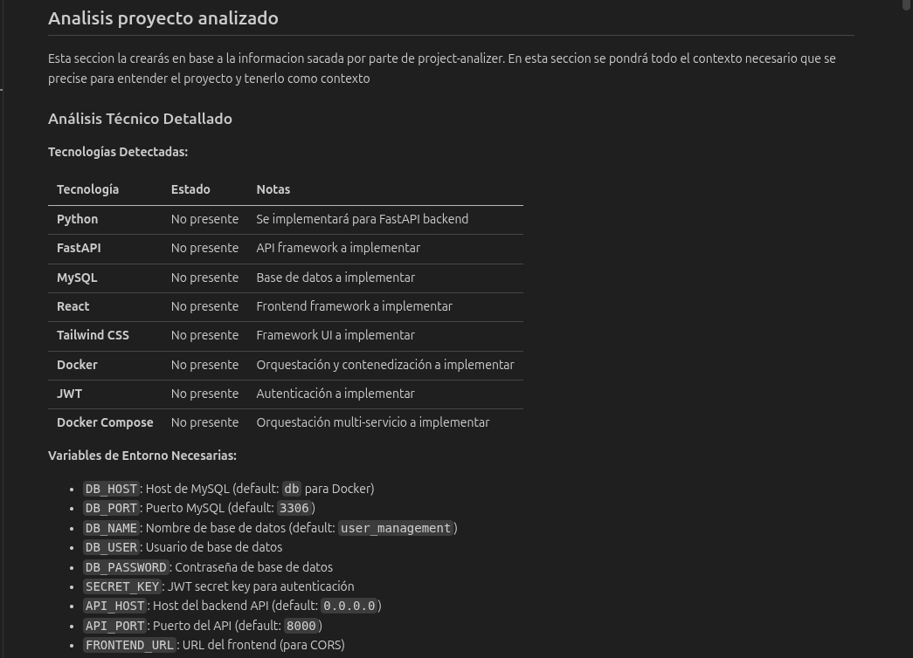
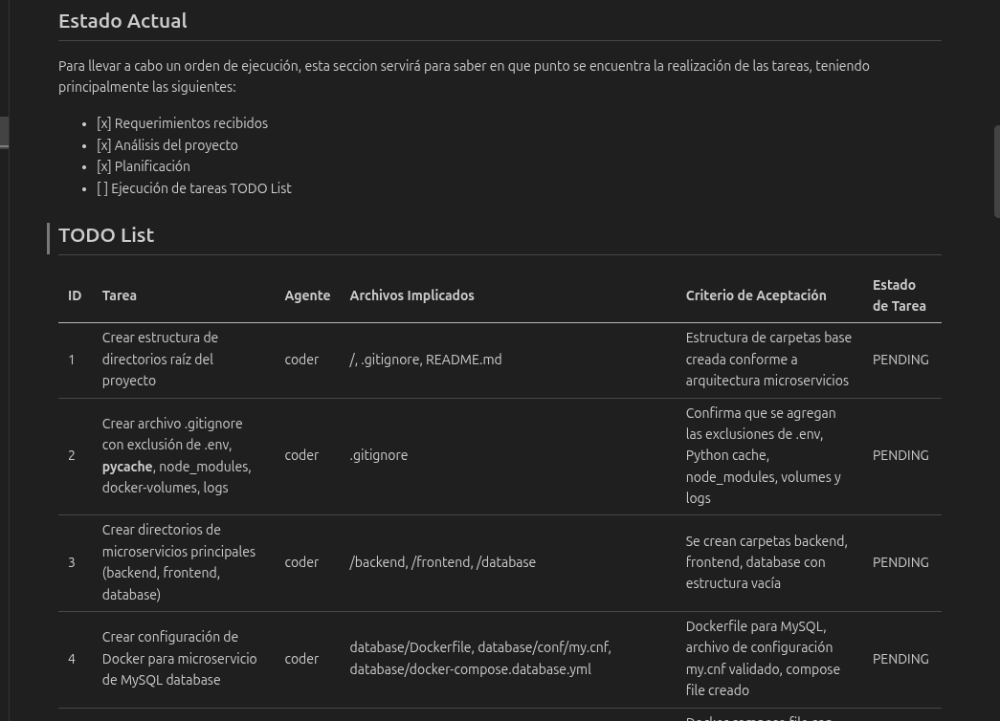
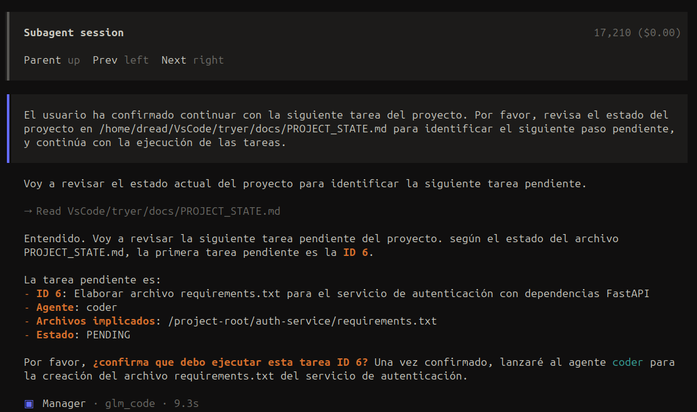
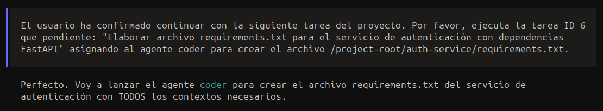
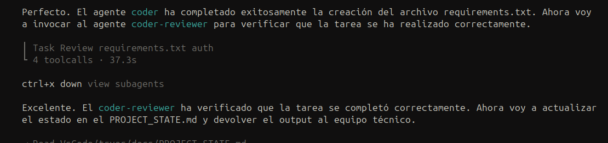
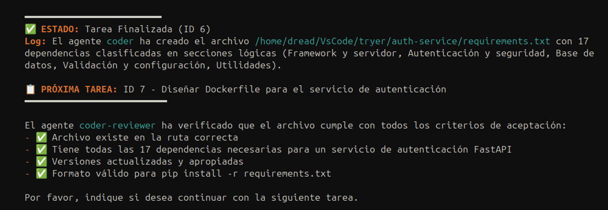

### Manager (manager.md)

**Description:** Technical leader who manages the project state and delegates tasks.  

**Main responsibilities:**
- Manage four MD files in `docs/`:
  - `REQUIREMENTS.md` — user requirements from project-leader
  - `FRAMEWORKS.md` — technologies in use from project-analizer
  - `PROJECT_STRUCTURE.md` — current or target structure from project-analizer
  - `PROJECT_STATE.md` — todo list from planner
- Coordinate calls to sub-agents: project-analizer, planner, coder-proposal, coder, coder-reviewer, child-documenter.
- Follow a strict state machine: **INIT → PLANNING → EXECUTION**.
- In EXECUTION: send task to `coder-proposal` first, then pass proposal to `coder`, then to `coder-reviewer`, and finally to `child-documenter` upon approval.
- Maintain task status (PENDING → DONE).  
- Never read source code or write code.

### Task Execution Examples  

#### First Interaction  

*During the first interaction the manager will always look for the `PROJECT_STATE.md` file and create it if it does not exist.*

##### Structure of the `PROJECT_STATE.md` file  

*The file begins by describing the user requirements.*

*It continues with an analysis of the current project—or the one to be created—based on those requirements.*

*A generic current state is generated, and a to‑do list with atomic tasks is created to fulfill the user requirements.*

##### Execution Flow  

*Upon its first execution, once `PROJECT_STATE` is visible to identify the task to start, it requests user confirmation.*

*After receiving confirmation, it calls the Coder agent to begin the task.*

*Once the Coder agent completes the task, the result is passed to the Reviewer agent for validation.*

*After the Reviewer confirms acceptance, the manager returns a final report to the user.*

