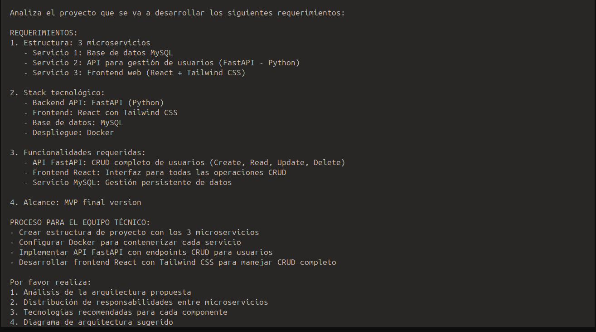
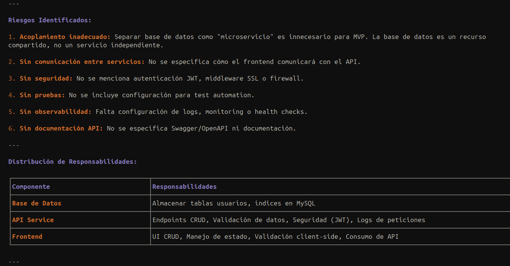
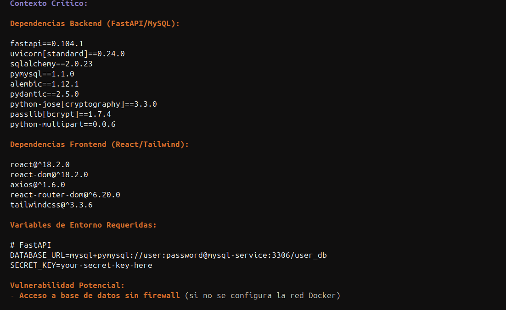
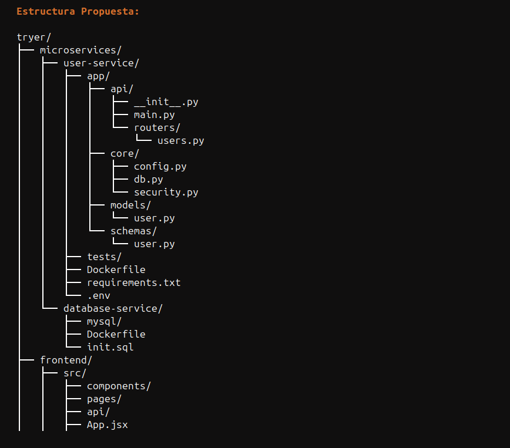
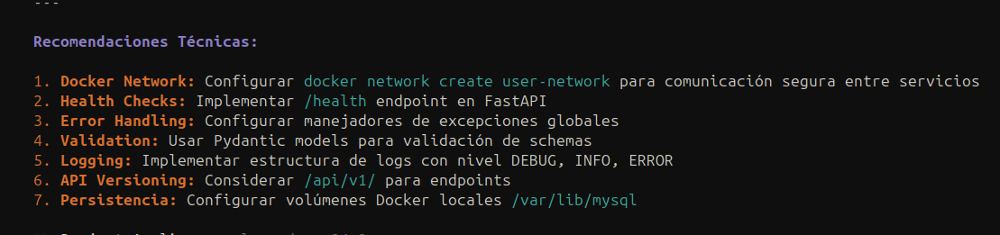
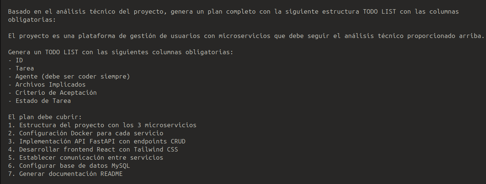
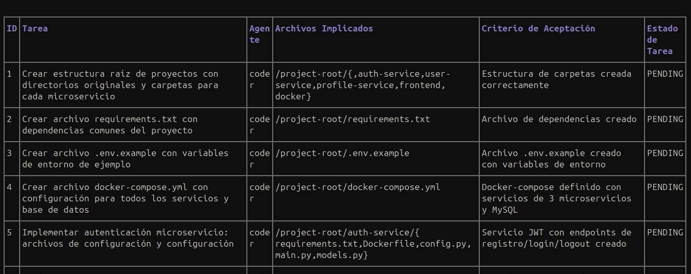

## Planner (planner.md) and Project‑Analyzer (project‑analyzer.md)

### Project‑Analyzer (project‑analyzer.md)
**Description:** Technical analysis agent that performs a comprehensive evaluation of existing code and the surrounding environment.  

**Main responsibilities:**
- Technical x‑ray of the environment  
- Project structure mapping  
- Detection of technologies and configurations  
- Reads key files to understand data flow  
- Returns findings in a specific schema: Detected Technologies, Architecture, Critical Context, Risks  
- Provides architecture and risk reports  
- Operates in read‑only mode  

#### Agent execution  

##### Repository state analysis  

*Using the first prompt received, the agent will search the current repository for its structure; if no code exists, it will create a blueprint of how the repo should be to accommodate all required functionalities.*

##### Final analysis report  

*Risk report identified during feature development*

*Critical context to consider when creating the feature*

*Proposed architecture for the feature*

*Technical recommendations for developing the feature*

---

### Planner (planner.md)
**Description:** Software architect that transforms requirements and analysis into an executable roadmap.  

**Main responsibilities:**
- Break down requirements into atomic tasks  
- Create logically ordered lists  
- Adhere to mandatory table formats  

**Key responsibilities:**
- Decompose requirements into small atomic tasks  
- Generate logically ordered task lists (Setup → Logic → Interface → Testing → Documentation)  
- Assign tasks to appropriate agents  
- Output tasks in a mandatory table format with specific columns  

#### Agent execution  

##### Analysis of the specification fed with data from the Project‑Analyzer  

*Receives the instruction to generate a plan of atomic tasks based on the requirements and the Project‑Analyzer report*

*Once verified that the task guidelines are met, it generates a report with the result [Approved / Denied]*

